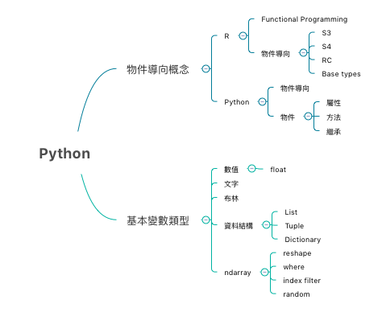

# Note 

## 4/17

- 練習Python 物件導向：屬性、方法、繼承、改寫的方法
- 物件的建立：定義類別、根據類別建立物件、使用物件的屬性、定義方法
- 變數的基本類型：數字文字、資料結構、ndarray

## 4/12
 
- 新增Xmind圖片在此md中，隨時更新。紀錄核心觀念
- 手動安裝Anaconda包，將Python path指過去。
- R: S3, S4, RC class http://ithelp.ithome.com.tw/articles/10185564

 Todo : http://ithelp.ithome.com.tw/articles/10185648

- 補充sublime中，中文編碼compile會爆掉的resource

## 4/06 Review

todo : 

- ~~review day1 ~ day5~~
- http://pandas.pydata.org/pandas-docs/stable/10min.html

## 3/31 Resource Fouding

- python 30 天學習筆記（主要跟隨這個）http://ithelp.ithome.com.tw/users/20103511/ironman/1077
- 新手 Python-机器学习 四部曲资源汇总 http://www.jianshu.com/p/9bb0bd8597a0
- 如何使用 Python 學習機器學習（Machine Learning） 
http://blog.kdchang.cc/2016/10/09/how-to-mastering-machine-learning-with-python/
- Python@TW
http://wiki.python.org.tw/Python/%E7%AC%AC%E4%B8%80%E6%AC%A1%E7%94%A8%E5%B0%B1%E4%B8%8A%E6%89%8B
- Jupyter Tutorial
http://codingpy.com/article/getting-started-with-jupyter-notebook-part-1/

## 3/30 Environment setting

- install package:
    - sidebareha...
    - anaconda
- ref : https://www.youtube.com/watch?v=xFciV6Ew5r4&list=PLHdu8He-62lrqeSVphHko7I7aR39RNfXE
- sublime show no output!
      - 發現是沒有裝python3
      - 按照這個安裝 https://stringpiggy.hpd.io/mac-osx-python3-dual-install/
      - 再將 `Python3.5.sublime-build` 這個python路徑改到剛剛安裝完的路徑位置 `/usr/local/Cellar/python3/3.5.1/bin/python3.5`
      - 再試一次cmd+B 應該就會出現囉（除非你將package controll的console打開，而非打開sublime的console

# Questions 

how to do the same something in R, like `help()` function, allowing us to understand the arguments in that function
